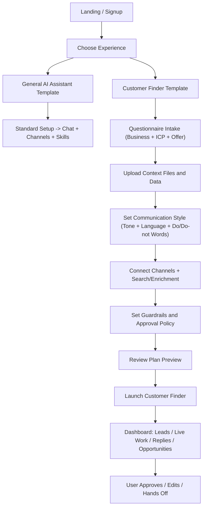

# ClawPilot Pivot: Managed Customer Finder

## Status
- Date: 2026-02-23
- Owner: ClawPilot team
- Stage: Product direction and UX flow definition (no implementation details)

## Why We Are Pivoting
ClawPilot currently delivers strong managed hosting for OpenClaw, but hosting alone is a commodity and hard to market.

We are repositioning from:
- "Managed OpenClaw hosting"

To:
- "Your 24/7 customer-finding employee powered by OpenClaw"

The core promise is business outcomes, not infrastructure:
- Find leads
- Personalize outreach
- Run follow-ups
- Manage replies
- Surface qualified opportunities

## New Product Packaging
We will offer two onboarding choices by default.

1. General AI Assistant Template
- For users who want full control and a general-purpose agent runtime.
- Value: managed uptime, easy setup, channel connections, OpenClaw access.

2. Customer Finder Template (Pre-configured)
- For users who want customer acquisition and outreach out of the box.
- Value: guided setup, pre-built agent workflow, structured dashboards, qualified lead pipeline.

## Template-First Product Concept
Users choose a template, not a technical mode.

Suggested templates:
1. General AI Assistant Template
- Equivalent to today's raw OpenClaw experience.

2. Customer Finder Template
- A pre-configured multi-agent workflow that operates continuously.

Suggested default agent roles:
1. Research Agent
- Finds candidate accounts/contacts based on ICP and filters.
2. Qualification Agent
- Scores and filters leads against fit criteria.
3. Personalization Agent
- Creates message angles using user context, assets, and business data.
4. Outreach and Reply Agent
- Sends outreach, manages follow-ups, handles back-and-forth within policy.

## What the Customer Provides
During onboarding, we ask direct questions and collect answers:
- Business profile (what they sell, who they sell to, geography, exclusions)
- Ideal customer profile (industry, role, company size, intent signals)
- Offer and positioning context
- Communication profile (voice, tone, language style, words to use/avoid)
- Uploads (pitch deck, case studies, one-pagers, pricing docs, FAQs, notes, CSVs)
- Channel choice (email, WhatsApp, Telegram, others as available)
- Search/enrichment configuration:
- Option A: customer connects their own API(s)
- Option B: ClawPilot managed setup
- Outreach guardrails (tone, forbidden claims, approvals, daily send limits)

## Communication Profile (Human-Sounding by Design)
To avoid robotic communication, the user defines how messages should sound.

Communication setup inputs:
1. Tone choice
- Examples: Professional, Friendly, Direct, Consultative, Founder Voice.
2. Language style
- Short vs detailed, casual vs formal, plain words vs technical words.
3. Do/Do-not wording
- "Always use these words/phrases."
- "Never use these words/phrases."
4. Sample messages
- User can paste 2-5 examples they like.
- System uses these as style references, not fixed templates.
5. Custom instruction box
- "Anything else we should follow when writing to prospects?"

Approval behavior:
- First outreach drafts are approval-first by default.
- User can edit and approve before sending.
- Once trust is established, user can switch to semi-auto or auto within limits.

## Data Surfaces the User Sees
The user should not operate through raw chat only. They should see structured outcomes.

Core visible outputs:
1. Lead Pipeline Table
- Discovered -> Qualified -> Ready to Contact -> Contacted -> Replied -> Qualified Opportunity
2. Outreach Queue
- Pending messages with reason and personalization context.
3. Replies Queue
- Incoming replies grouped by campaign/thread and recommended next action.
4. Qualified Opportunities
- Final handoff list with contact, context, interest signal, and next step.
5. Daily/Weekly Report
- Activity volume, reply rate, positive reply rate, pipeline contribution.
6. Voice and Messaging Preview
- Live examples of how the current communication style is being applied.

## User Flow (High-Level)

## Detailed UX Flow

### 1) Entry and Choice
- User signs up/signs in.
- First key decision screen (template selection):
- "General AI Assistant"
- "Customer Finder (recommended if your goal is customer acquisition)"

### 2) General AI Assistant Template (baseline)
- User continues current setup.
- Ends in general OpenClaw chat/workspace.

### 3) Customer Finder Template (new default for business users)
Wizard-style onboarding with clear progress:

1. Business Snapshot
- Company description, product/service, value proposition.

2. ICP and Targeting
- Who to target, who to avoid, regions, company size, titles, industries.

3. Offer and Messaging Context
- Offer details, differentiators, proof points, CTA style.

4. Communication Style Setup
- Select tone profile and language level.
- Add words/phrases to use and avoid.
- Provide sample messages as writing references.
- Add any custom instruction for outreach/reply writing behavior.

5. Upload Knowledge
- Upload files and optional lead seed lists.

6. Channels and Data Sources
- Connect outbound channels.
- Connect customer APIs or choose managed search setup.

7. Guardrails
- Daily limits, approval requirements, disallowed claims, fallback behavior.

8. Plan Preview and Confirmation
- Show how the template will run:
- what it will research
- what it will send
- what requires approval

### 4) First-Time Value Moment
Immediately after launch, user sees:
- Initial lead list generated
- First draft outreach queue
- Clear "approve and send" action
- A live work panel: what the system is currently working on
- Optional agent activity view (if exposed): which agent is doing what now

This is critical to convert onboarding into trust.

### 5) Day-to-Day Operating Flow
User primarily works from dashboard tabs, not free-form chat:

1. Overview
- Campaign status, volume, outcomes.
2. Leads
- Review and adjust qualification filters.
3. Outreach
- Approve/edit queued messages.
4. Replies
- Review active conversations and proposed next responses.
5. Voice Settings
- Adjust tone, wording rules, and communication behavior without rebuilding setup.
6. Opportunities
- Export or handoff qualified opportunities.
7. Reports
- Weekly performance summary and pipeline impact.

### 6) Reply Handling and Handoff
When prospects reply:
- Agent continues within guardrails.
- If intent threshold is met, move contact to Qualified Opportunities.
- If human intervention is needed, mark as "Needs Human Review."

### 7) Success State
User feels they have a dependable outbound employee:
- Continuous top-of-funnel generation
- Structured follow-up coverage
- Clear qualified handoff pipeline

## Product Messaging Direction
Primary:
- "Launch your 24/7 customer-finding employee in minutes."

Secondary:
- "Choose a template: General AI Assistant or Customer Finder."

Proof framing:
- "From ICP setup to qualified opportunities in one workflow."

## Scope Boundary for This Document
This document defines:
- Pivot strategy
- Product packaging
- End-user flow

This document intentionally does not define:
- Backend architecture
- Data model schema
- API and system implementation details
